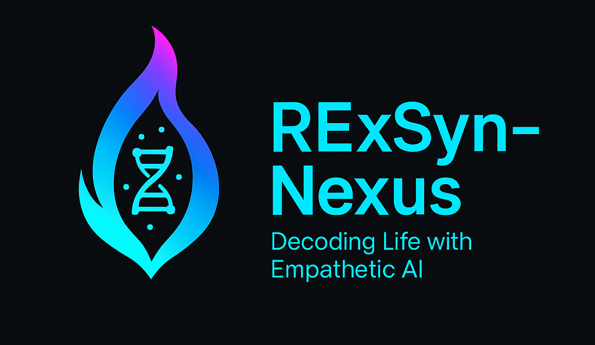
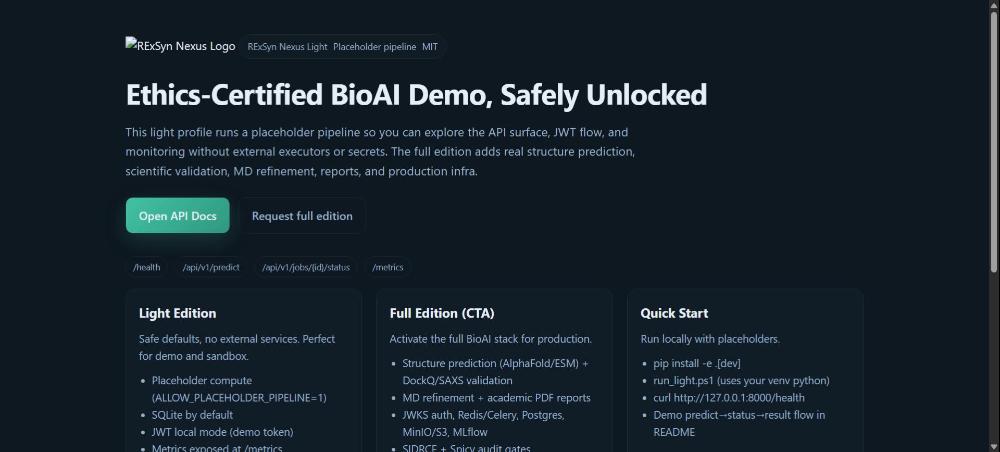

# RExSyn Nexus Light Edition

<div align="center">



[](https://github.com/flamehaven01/RExSyn-Nexus-light/actions/workflows/ci.yml)
[](https://github.com/flamehaven01/RExSyn-Nexus-light/actions/workflows/ci.yml)
[](CHANGELOG.md)
[](LICENSE)
[](UPGRADE_SPEC_v0.1.0.md)

</div>

---

## Overview

**RExSyn Nexus Light v0.0.5** is a production-ready, **S++ architecture-planned** BioAI platform for protein structure prediction workflows. This edition runs with a **placeholder pipeline** optimized for rapid deployment, API evaluation, and integration testing—without requiring external executors or heavy computational infrastructure.

The Light edition provides complete API surface, authentication system, rate limiting, metrics, and interactive frontend. **v0.0.5 adds comprehensive upgrade planning** with detailed specifications for v0.1.0 enhancements including Omega Scorer Lite, Scenario Engine, and Visual Feedback systems.

**What's New in v0.0.5:**
- [+] **Upgrade Specification**: 850+ line detailed implementation plan for v0.1.0 (UPGRADE_SPEC_v0.1.0.md)
- [+] **Documentation Overhaul**: Enhanced README with Light vs Full comparison table
- [+] **Architecture Planning**: S++ certification roadmap and quality metrics
- [+] **Security Roadmap**: Dependency update plan aligned with Full Edition patches

**Planned for v0.1.0** (see [UPGRADE_SPEC_v0.1.0.md](UPGRADE_SPEC_v0.1.0.md)):
- **Omega Scorer Lite**: I×P×(1-Δ) geometric mean with S++/S+/S/A/B/C/D/F grading
- **Scenario Engine**: Deterministic simulations (Perfect/Drift/Empathy Fail)
- **Visual Feedback**: Empathy gate alerts + Omega breakdown displays
- **Security Updates**: 8 dependency patches (FastAPI, SQLAlchemy, etc.)

📊 **Current Status**: v0.0.4 → **v0.0.5** (Documentation & Planning)  
📖 **Next Release**: v0.1.0 with Omega Scoring + Scenario Engine (Q1 2025)  
📋 **Comparison**: See [WIKI.md](WIKI.md) for detailed Light vs Full feature matrix

### Platform Preview

<div align="center">

<p><em>Interactive frontend with API console, health monitoring, and real-time metrics</em></p>
</div>

---

## Features

### Core Platform (Light Edition)

| Feature | Description | Status |
|---------|-------------|--------|
| **Placeholder Pipeline** | Fast-response mock executor for API testing | ✅ Active |
| **Authentication & RBAC** | JWT-based auth with role-based access control | ✅ Active |
| **Rate Limiting** | SlowAPI integration with per-user/IP limits | ✅ Active |
| **Request Guards** | Body size validation, input sanitization | ✅ Active |
| **Database** | SQLite with SQLAlchemy ORM | ✅ Active |
| **Metrics & Monitoring** | Prometheus-compatible `/metrics` endpoint | ✅ Active |
| **Health Checks** | `/health` with component status reporting | ✅ Active |
| **API Documentation** | Auto-generated OpenAPI/Swagger at `/docs` | ✅ Active |
| **Interactive Frontend** | 4-page UI (landing, console, monitoring, preview) | ✅ Active |
| **CI/CD** | GitHub Actions with coverage gates (40%+) | ✅ Active |

### Frontend Pages

1. **Landing Page** (`frontend/landing/code.html`)
   - Edition comparison (Light vs Full)
   - Quick start instructions
   - Feature highlights

2. **API Console** (`frontend/api_console/code.html`)
   - Interactive `/predict` → `/status` → `/result` workflow
   - Request history (localStorage, max 20 entries)
   - Error handling with color-coded feedback

3. **Status Monitoring** (`frontend/status_monitoring/code.html`)
   - Real-time `/health` endpoint polling
   - Prometheus metrics viewer (`rsn_*` gauges)
   - Auto-refresh toggle (5-second intervals)

4. **Full Edition Preview** (`frontend/full_edition_preview/code.html`)
   - Feature comparison grid
   - B2B upgrade options
   - Contact links

---

## Getting Started

### Prerequisites
- Python 3.11+
- Virtual environment (recommended)

### Installation

```powershell
# Clone repository
git clone https://github.com/flamehaven01/RExSyn-Nexus-light.git
cd RExSyn-Nexus-light

# Install dependencies
pip install -e .[dev]
# or
pip install -r requirements.txt
```

### Quick Start

**Option 1: Automated script**
```powershell
./run_light.ps1
```

**Option 2: Manual startup**
```powershell
# Set environment variables
$env:ALLOW_PLACEHOLDER_PIPELINE="1"
$env:RSN_JWKS_URL="local"
$env:RSN_SECRET_KEY="demo-secret"
$env:JWT_SECRET_KEY="demo-jwt"
$env:DATABASE_URL="sqlite:///D:/Sanctum/tmp/rsn-light.db"
$env:DB_URL=$env:DATABASE_URL

# Start server
cd backend
python -m uvicorn app.main:app --port 8000
```

### Verify Installation

```bash
# Health check
curl http://127.0.0.1:8000/health

# API documentation
open http://127.0.0.1:8000/docs

# Interactive UI
open http://127.0.0.1:8000/ui
```

---

## Usage

### API Workflow Example (PowerShell)

```powershell
# Configure
$token = "demo-local-jwt-token-placeholder"
$base = "http://127.0.0.1:8000"
$body = @{
    sequence = "ACDEFGHIKLMNPQRSTVWY"
    experiment_type = "protein_folding"
    method = "alphafold3"
} | ConvertTo-Json

# Step 1: Submit prediction job
$predict = Invoke-RestMethod -Method Post `
    -Uri "$base/api/v1/predict" `
    -Headers @{ Authorization = "Bearer $token" } `
    -ContentType "application/json" `
    -Body $body

$jobId = $predict.job_id
Write-Host "Job ID: $jobId"

# Step 2: Check status
Invoke-RestMethod -Uri "$base/api/v1/jobs/$jobId/status" `
    -Headers @{ Authorization = "Bearer $token" }

# Step 3: Retrieve result
Invoke-RestMethod -Uri "$base/api/v1/jobs/$jobId/result" `
    -Headers @{ Authorization = "Bearer $token" }
```

### Frontend Usage

1. **Backend running:** Navigate to `http://localhost:8000/ui`
2. **Offline exploration:** Open `frontend/index.html` in browser

---

## Testing

### Run Test Suite

```bash
# Run all tests with coverage
pytest --cov=backend/app/api --cov=backend/app/core --cov-report=term-missing --cov-fail-under=45

# Run specific test modules
pytest tests/test_predict.py -v
pytest tests/test_auth.py -v
```

### Coverage Requirements

- **Minimum:** 40% (Light profile with placeholder pipeline)
- **CI Gate:** 45% on `backend/app/api` and `backend/app/core`
- Placeholder services excluded from coverage targets

---

## Full Edition Upgrade

### What's Included in Full Edition

| Category | Light Edition | Full Edition |
|----------|---------------|--------------|
| **Structure Prediction** | Placeholder responses | AlphaFold3, ESMFold, RoseTTAFold executors |
| **Scientific Validation** | ❌ Not included | DockQ v2, SAXS χ², PoseBusters |
| **MD Refinement** | ❌ Not included | GROMACS integration with artifacts |
| **Reports** | ❌ Not included | Academic PDF reports with graphs |
| **Database** | SQLite | PostgreSQL with replication |
| **Task Queue** | ❌ Not included | Redis + Celery workers |
| **Storage** | Local filesystem | MinIO/S3 with versioning |
| **Experiment Tracking** | ❌ Not included | MLflow integration |
| **Infrastructure** | Single-server | Helm charts, Kubernetes-ready |
| **Governance** | Basic audit logs | SIDRCE + SpicyFileReview gates |
| **Auth** | Local JWKS | JWKS-based RBAC (RS256/ES256) |
| **Monitoring** | Basic Prometheus | Grafana dashboards + alerts |

📖 **Detailed Comparison:** [WIKI.md](WIKI.md)

### Request Full Edition Access

- **Email:** info@flamehaven.space
- **GitHub Issue:** [Create B2B Request](https://github.com/flamehaven01/RExSyn-Nexus-light/issues/new?labels=b2b-request&template=b2b_request.md&title=B2B%20Full%20Edition%20Request)

---

## Architecture

### Technology Stack

- **Backend:** FastAPI 0.110+, Python 3.11+
- **Database:** SQLAlchemy 2.0 + SQLite (Light) / PostgreSQL (Full)
- **Auth:** JWT with local JWKS (Light) / Remote JWKS (Full)
- **Rate Limiting:** SlowAPI with Redis backend
- **Metrics:** Prometheus client (`rsn_*` namespace)
- **Frontend:** Vanilla HTML/CSS/JS with Tailwind CSS

### Project Structure

```
RExSyn-Nexus-light/
├── backend/
│   ├── app/
│   │   ├── api/         # API endpoints (v1)
│   │   ├── core/        # Config, security, dependencies
│   │   ├── db/          # Models, database connection
│   │   ├── services/    # Business logic (placeholder)
│   │   └── main.py      # FastAPI application
│   └── tests/           # Pytest suite
├── frontend/
│   ├── index.html       # Navigation hub
│   ├── landing/         # Landing page
│   ├── api_console/     # Interactive API tester
│   ├── status_monitoring/ # Health & metrics viewer
│   └── full_edition_preview/ # Upgrade CTA
├── .github/
│   └── workflows/       # CI/CD pipelines
└── docs/
    ├── WIKI.md          # Light vs Full comparison
    ├── LOCAL_RUN.md     # Development guide
    └── CONTRIBUTING.md  # Contributor guidelines
```

---

## Contributing

We welcome contributions! Please see [CONTRIBUTING.md](CONTRIBUTING.md) for guidelines.

**Focus Areas for Light Edition:**
- ✅ Frontend UX improvements
- ✅ API documentation enhancements
- ✅ Test coverage expansion
- ✅ Bug fixes and error handling

**Full-stack features** (real executors, validators, MD) belong in the Full Edition. Open an issue to discuss before implementing.

---

## Roadmap

### v0.0.5 (Current Release - 2025-12-31) ✅
- [x] **Documentation Overhaul**: Comprehensive README + CHANGELOG updates
- [x] **Upgrade Specification**: Detailed v0.1.0 implementation plan (850+ lines)
- [x] **Architecture Planning**: S++ certification roadmap
- [x] **Feature Comparison**: Enhanced Light vs Full matrix

### v0.1.0 (Planned - 2025-Q1) 🚀  
See [UPGRADE_SPEC_v0.1.0.md](UPGRADE_SPEC_v0.1.0.md) for details
- [ ] **Omega Scorer Lite**: I×P×(1-Δ) with grade certification
- [ ] **Scenario Engine**: Perfect/Drift/Empathy Fail modes
- [ ] **Visual Feedback**: Empathy gate alerts + Omega displays
- [ ] **Security Updates**: 8 dependency patches
- [ ] **RBAC Testing**: Enhanced test coverage

### v0.2.0 (Future - 2025-Q2) 📋
- [ ] WebSocket support for real-time updates
- [ ] Docker Compose production setup
- [ ] Interactive scenario builder UI
- [ ] Enhanced API rate limiting (per-endpoint)

### Full Edition (Contact for Access)

- Real structure prediction executors
- Scientific validation pipeline
- MD refinement workflows
- MLflow experiment tracking
- Kubernetes deployment manifests
- SIDRCE governance integration

---

## Target Audience

- **Research Labs:** Quick API evaluation without infrastructure setup
- **Biotech Startups:** Prototype integration before Full Edition deployment
- **Clinical Teams:** Test workflows with placeholder data
- **Developers:** Explore BioAI API patterns and authentication

---

## License

MIT License - See [LICENSE](LICENSE) file for details.

**Commercial Use:** Light Edition is MIT-licensed. Full Edition requires commercial license. Contact info@flamehaven.space for details.

---

## Contact & Support

- **Email:** info@flamehaven.space
- **Issues:** [GitHub Issues](https://github.com/flamehaven01/RExSyn-Nexus-light/issues)
- **Wiki:** [Light vs Full Comparison](WIKI.md)
- **Documentation:** See `docs/` directory

---

## Acknowledgments

Built with ethics-first principles. Rate limiting, request guards, and audit logging are enabled by default to prevent misuse and ensure responsible AI deployment.

**Star ⭐ this repository** if you find it useful for your research or development workflow!
